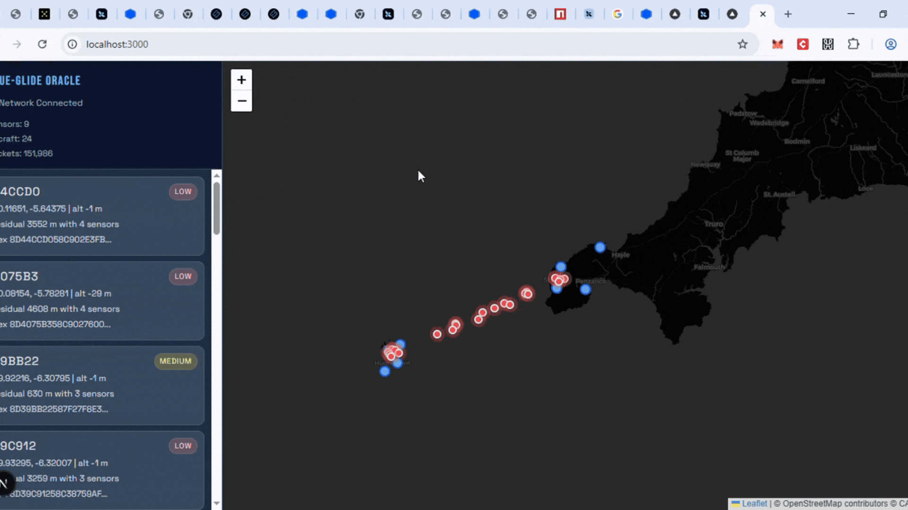

# Blue Glide Neuron Challenge

Blue Glide is a buyer-side Neuron challenge project that ingests live Mode-S frames from sellers, solves aircraft position with multilateration (MLAT), and serves real-time results to a web dashboard.

## Demo



## What This Project Does

- Connects as a Neuron buyer to multiple sellers
- Reads structured Mode-S packets (sensor metadata + timestamps + raw frame)
- Applies sensor location overrides from `location-override.json`
- Groups multi-sensor observations of the same transmission
- Solves position using TDOA-based MLAT in ECEF
- Exposes live state over REST and server-sent events (SSE)
- Displays aircraft and sensor activity in a Next.js map UI

## Architecture

### Backend (Go)

- `main.go`: application entrypoint using Neuron SDK
- `app.go`: orchestration (stream handling, receiver lifecycle)
- `packet.go`: stream packet parsing
- `location.go`: location override loading and application
- `geometry.go`: WGS84 LLH <-> ECEF math
- `mlat_solver.go`: iterative least-squares solver
- `mlat_tracker.go`: message grouping and solve trigger
- `sensor_manager.go`: in-memory state and metrics
- `event_bus.go`: pub/sub for streaming events
- `api_server.go`: REST + SSE server on `:8080`
- `models.go`: shared domain models

### Frontend (Next.js)

- Hydrates from REST endpoints
- Streams updates from `/events`
- Renders sensors + aircraft on a live Leaflet map
- Shows solution confidence, residual, and sensor counts

## API

Backend runs on `http://localhost:8080`:

- `GET /api/health`
- `GET /api/sensors`
- `GET /api/aircraft`
- `GET /api/stats`
- `GET /events` (SSE)

Frontend dev server runs on `http://localhost:3000` and proxies:

- `/api/*` -> `http://localhost:8080/api/*`
- `/events` -> `http://localhost:8080/events`

## Prerequisites

- Go 1.24.x
- Node.js 20+ (or Bun)
- Buyer credentials in `.buyer-env`
- Router/host port forwarding for UDP `61336` if required by your network

## Setup

1. Install Go dependencies:

```bash
go mod download
```

2. Prepare buyer environment file:

```bash
cp .buyer-env.example .buyer-env
```

3. Fill `.buyer-env` with challenge-provided values (especially seller list and credentials).

4. Optional frontend install:

```bash
cd web
npm install
```

## Run (Recommended)

### Terminal 1: backend

Run from repository root:

```bash
go run . --port=61336 --mode=peer --buyer-or-seller=buyer --list-of-sellers-source=env --envFile=.buyer-env
```

Important: use `go run .` (dot), not `go run main.go`. The project is split across multiple Go files.

### Terminal 2: frontend

From `web`:

```bash
npm run dev
```

Or with Bun:

```bash
bun run dev
```

Then open `http://localhost:3000`.

## Common Runtime Notes

### `undefined: NewBlueGlideApp`

Cause: running only one file.

Fix:

```bash
go run . --port=61336 --mode=peer --buyer-or-seller=buyer --list-of-sellers-source=env --envFile=.buyer-env
```

### `stream read stopped: deadline exceeded`

This means a stream read timed out waiting for the next packet. It can occur under sparse traffic, peer pauses, or idle intervals.

- If streams reconnect and data continues, it is often transient.
- If it is frequent and no data appears, increase read timeout handling in stream loop and verify seller activity.

### UDP buffer warning from quic-go

Example warning about receive buffer not reaching requested size can be normal on some hosts. It is advisory unless packet loss/instability is observed.

## Challenge Guidance

- Start by validating sensor connectivity and packet ingestion.
- Confirm sensor locations (and overrides) are accurate.
- Ensure at least 3 sensors observe the same transmission for MLAT.
- Track residual and confidence metrics to judge solution quality.
- Iterate on clustering window and solver constraints for stability.

## Security

- Never commit `.buyer-env` or private keys.
- Keep credentials local.

## License

See repository license information.
